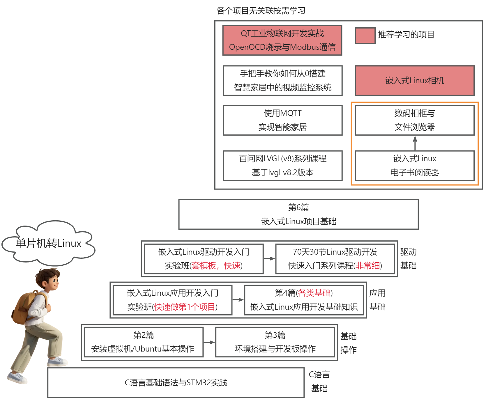

# 学习路线介绍

单片机工程师大多数有硬件基础，能看懂原理图，能理解硬件协议。那么不要浪费自己的优势：不仅学习APP，也学习驱动。
学习路线为：先掌握APP开发基础，驱动基础，然后多做项目。
按照下图从下往上学习。

## 学习路线

## 对应课程观看
1. C语言基础，必看：[/docs/Linux-CourseList/CLanguageBasic/Introduction](/docs/Linux-CourseList/CLanguageBasic/Introduction) 主要适用于没有完整学习过C语言，或者对C语言不是很熟悉的同学，学完此课程以后，对于后续的课程，学习起来会更容易理解。

2.

3.

