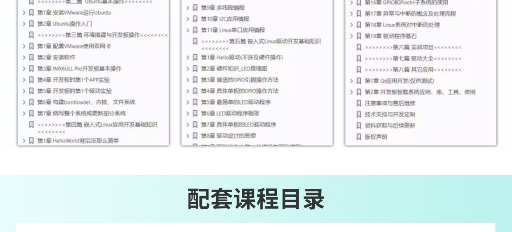
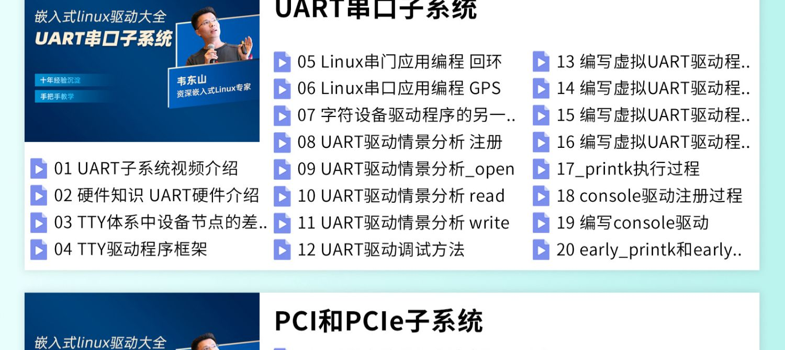
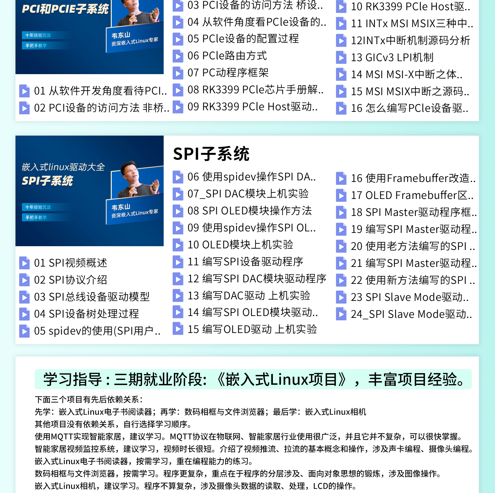

# IMX6ULL-PRO开发板

## 产品链接
- 天猫店铺：https://detail.tmall.com/item.htm?id=624976567583
- 淘宝店铺：https://item.taobao.com/item.htm?id=610613585935

## 产品参数

 - 资料下载：https://download.100ask.net/boards/Nxp/100ask_imx6ull_pro/index.html
 - 开发板配套资料：百度云网盘：链接：https://pan.baidu.com/s/1NsAIRkQj0bOaPDWdSkBuXw 密码： root
 - 实验班配套资料：跟上面的网盘资料中的 “02_开发工具/100ask-vmware_ubuntu18.04” 不一样 实验班的虚拟机里装好了vscode、下载好了Linux源码
百度云网盘下载地址： https://pan.baidu.com/s/1SjpWb0K-dL2C06DjUEuA_A?pwd=qjke 密码： qjke

## 适用学习路线
1. 零基础或只学APP开发 [/docs/Learn-Linux/ZeroLearning-LinuxAPP/Introduction](/docs/Learn-Linux/ZeroLearning-LinuxAPP/Introduction)
2. 从单片机转Linux [/docs/Learn-Linux/FromMCU-Linux/Introduction](/docs/Learn-Linux/FromMCU-Linux/Introduction)

3. 全栈Linux学习 [/docs/Learn-Linux/FromMCU-Linux/Introduction](/docs/Learn-Linux/FromMCU-Linux/Introduction)

## 详情介绍

