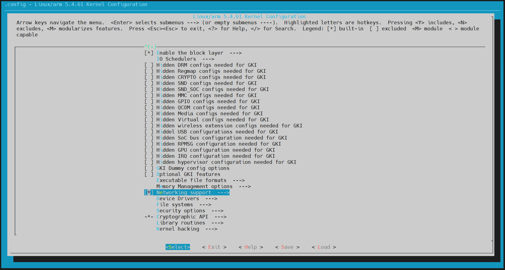
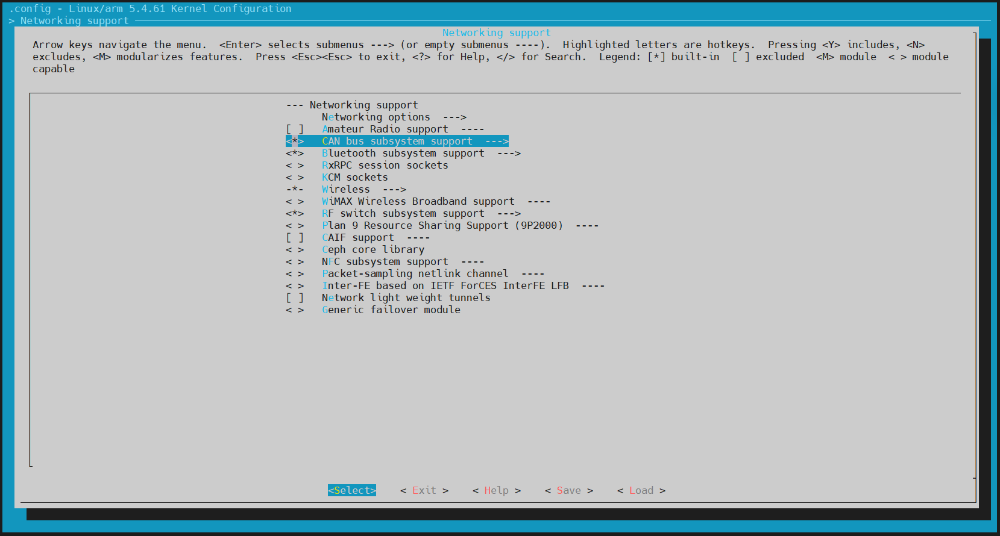
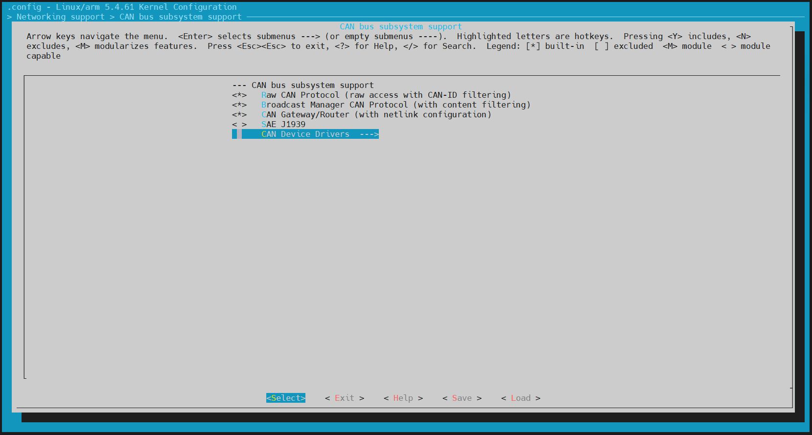
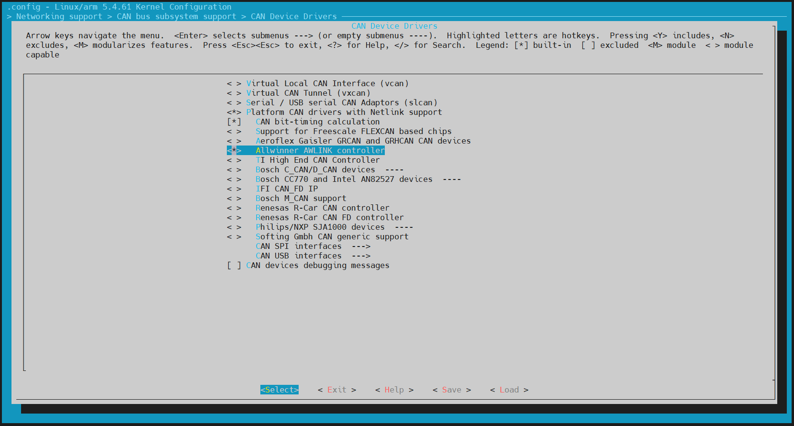
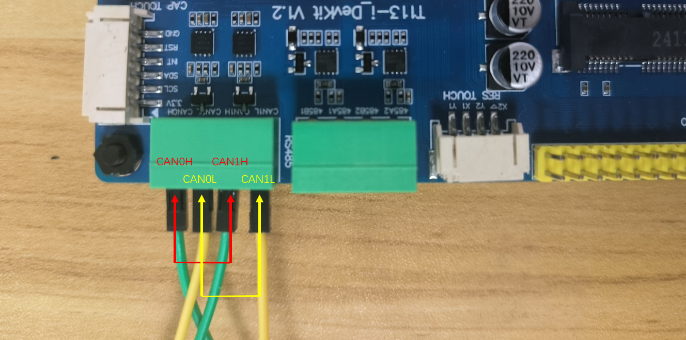

# 支持CAN功能

## 1.使能设备树CAN节点

在t113-i开发板的设备树中，CAN的设备树节点不叫can，名称是awlink。

进入`t113i_tinasdk5.0-v1/device/config/chips/t113_i/configs/evb1_auto/linux-5.4/board.dts`

~~~bash
ubuntu@dshanpi:~/meihao/t113i_tinasdk5.0-v1/device/config/chips/t113_i/configs/evb1_auto/linux-5.4$ vim board.dts
~~~

使能awlink0和awlink1，默认处于使能状态。

## 2.配置内核驱动

进入SDK源码根目录`t113i_tinasdk5.0-v1/`

执行`./build.sh menuconfig`，打开内核配置界面。

点击键盘上的`/`键，搜索`awlink`

根据路径，找到`Allwinner AWLINK controller`选项。

选择`Networking support`，点击`enter`键进入。

找到`CAN bus subsystem support`，点击`enter`键进入。

之后，找到`CAN Device Drivers`，点击`enter`键进入。

找到`Allwinner AWLINK controller`，点击键盘上的`y`键选上。

最后保存，退出。

在SDK源码根目录`t113i_tinasdk5.0-v1/`下，执行`./build.sh kernel`编译内核，再执行`./build.sh `，最后打包`./build.sh pack`。

打包完成后，根据之前的烧录方式，烧录到开发板上。

## 3.测试CAN功能

烧录完成后，进入开发板。

在开发板上，执行`ifconfig -a`，查看是否存在`awlink0`和`awlink1`。

~~~bash
# ifconfig  -a
awlink0   Link encap:UNSPEC  HWaddr 00-00-00-00-00-00-00-00-00-00-00-00-00-00-00-00
          NOARP  MTU:16  Metric:1
          RX packets:0 errors:0 dropped:0 overruns:0 frame:0
          TX packets:0 errors:0 dropped:0 overruns:0 carrier:0
          collisions:0 txqueuelen:10
          RX bytes:0 (0.0 B)  TX bytes:0 (0.0 B)

awlink1   Link encap:UNSPEC  HWaddr 00-00-00-00-00-00-00-00-00-00-00-00-00-00-00-00
          NOARP  MTU:16  Metric:1
          RX packets:0 errors:0 dropped:0 overruns:0 frame:0
          TX packets:0 errors:0 dropped:0 overruns:0 carrier:0
          collisions:0 txqueuelen:10
          RX bytes:0 (0.0 B)  TX bytes:0 (0.0 B)
          Interrupt:1

eth0      Link encap:Ethernet  HWaddr 42:5A:1A:01:32:43
          BROADCAST MULTICAST  MTU:1500  Metric:1
          RX packets:0 errors:0 dropped:0 overruns:0 frame:0
          TX packets:0 errors:0 dropped:0 overruns:0 carrier:0
          collisions:0 txqueuelen:1000
          RX bytes:0 (0.0 B)  TX bytes:0 (0.0 B)
          Interrupt:40

ip6tnl0   Link encap:UNSPEC  HWaddr 00-00-00-00-00-00-00-00-00-00-00-00-00-00-00-00
          NOARP  MTU:1452  Metric:1
          RX packets:0 errors:0 dropped:0 overruns:0 frame:0
          TX packets:0 errors:0 dropped:0 overruns:0 carrier:0
          collisions:0 txqueuelen:1000
          RX bytes:0 (0.0 B)  TX bytes:0 (0.0 B)

lo        Link encap:Local Loopback
          inet addr:127.0.0.1  Mask:255.0.0.0
          inet6 addr: ::1/128 Scope:Host
          UP LOOPBACK RUNNING  MTU:65536  Metric:1
          RX packets:0 errors:0 dropped:0 overruns:0 frame:0
          TX packets:0 errors:0 dropped:0 overruns:0 carrier:0
          collisions:0 txqueuelen:1000
          RX bytes:0 (0.0 B)  TX bytes:0 (0.0 B)

sit0      Link encap:IPv6-in-IPv4
          NOARP  MTU:1480  Metric:1
          RX packets:0 errors:0 dropped:0 overruns:0 frame:0
          TX packets:0 errors:0 dropped:0 overruns:0 carrier:0
          collisions:0 txqueuelen:1000
          RX bytes:0 (0.0 B)  TX bytes:0 (0.0 B)

#
~~~

可以看到，通过ifconfig命令查看CAN接口功能为正常，下面进行CAN功能的收发测试。

测试之前，先使用两根杜邦线，一根将 `CAN0 L` 连接至 `CAN1 L`，另一根将 `CAN0 H`连接 `CAN1 H`。

连接如下图：

连接好线后，做以下几个步骤进行测试。

**①使用ip命令设置awlink接口的速度为500Kb/s**

> 注意：需要设置完成awlink接口速度才能使能awlink接口！！！

~~~bash
# ip link set awlink0 type can bitrate 500000
# ip link set awlink1 type can bitrate 500000
~~~

**②打开awlink网卡**

~~~bash
# ifconfig awlink0 up
[ 1105.138598] IPv6: ADDRCONF(NETDEV_CHANGE): awlink0: link becomes ready
# ifconfig awlink1 up
[ 1106.368692] IPv6: ADDRCONF(NETDEV_CHANGE): awlink1: link becomes ready
#
~~~

**③设置awlink0接收数据**

~~~bash
# candump awlink0 &
[1] 1386
~~~

**④向awlink0发送数据**

~~~bash
# cansend awlink0 5A1#11.22.33.44.55.66.77.88
  awlink0  5A1   [8]  11 22 33 44 55 66 77 88
~~~

上述cansend命令中，“5A1”是帧ID，“#”后面的“11.22.33.44.55.66.77.88”是要发送的数据，十六进制。CAN2.0一次最多发送8个字节的数据，8字节数据之间用“.”隔开，can-utils会对数据进行解析。

