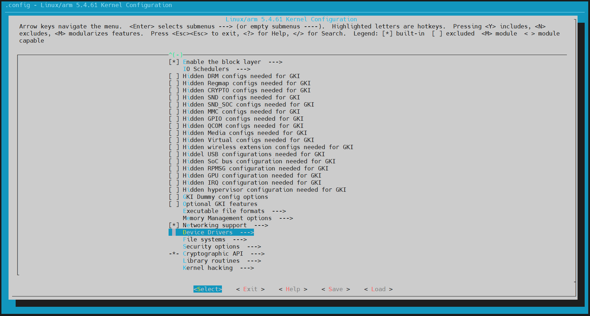
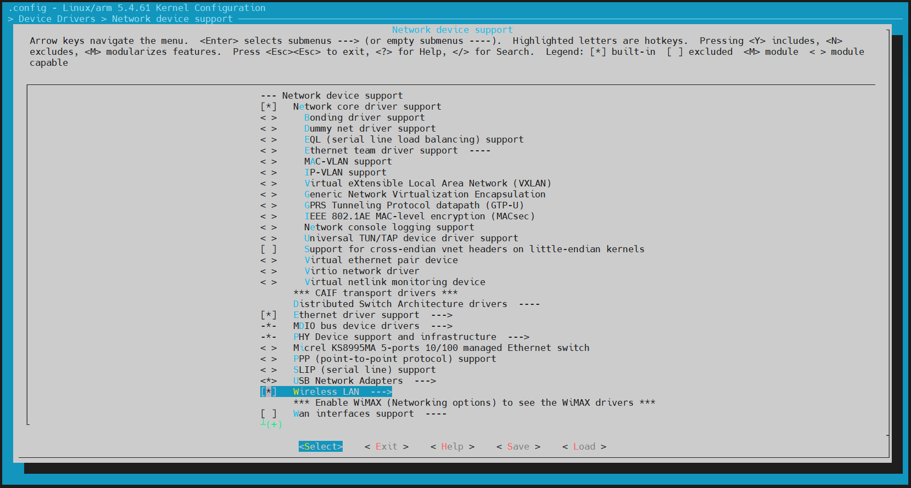
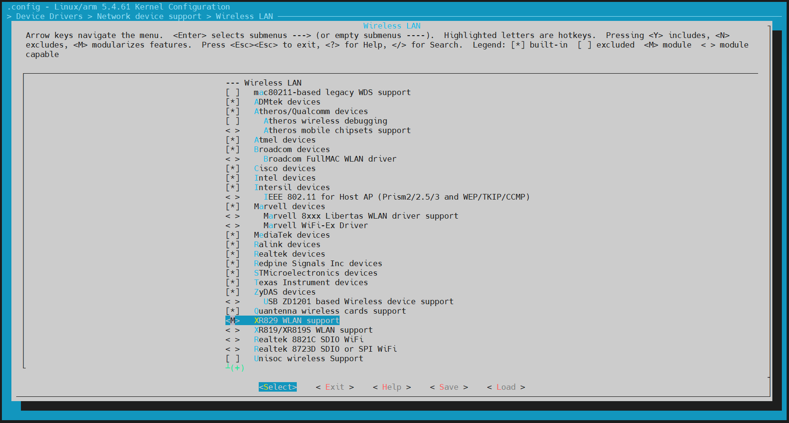
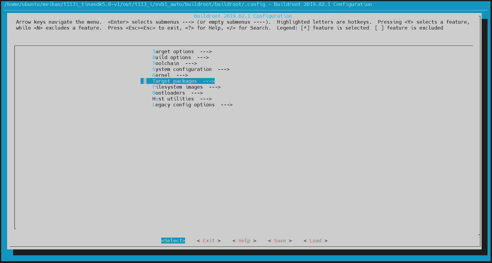
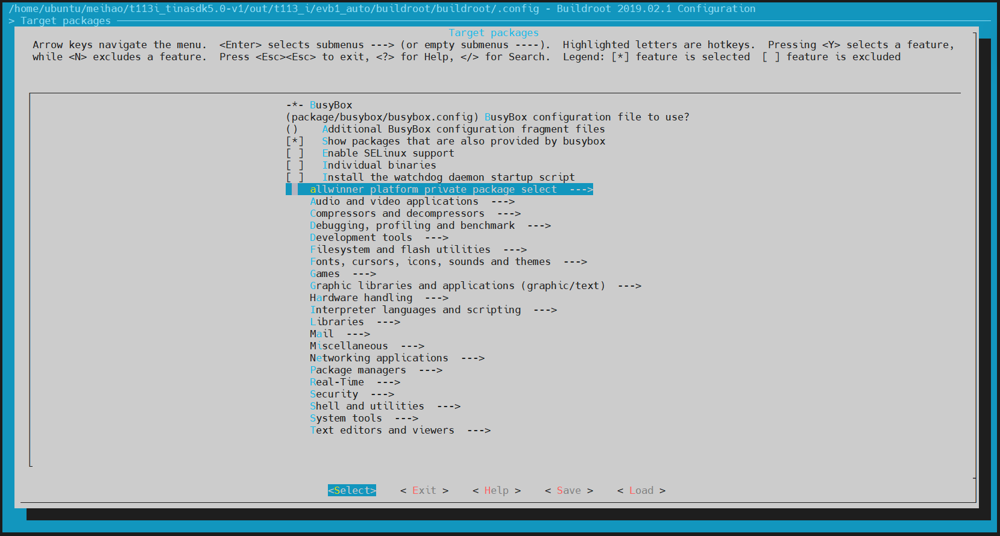
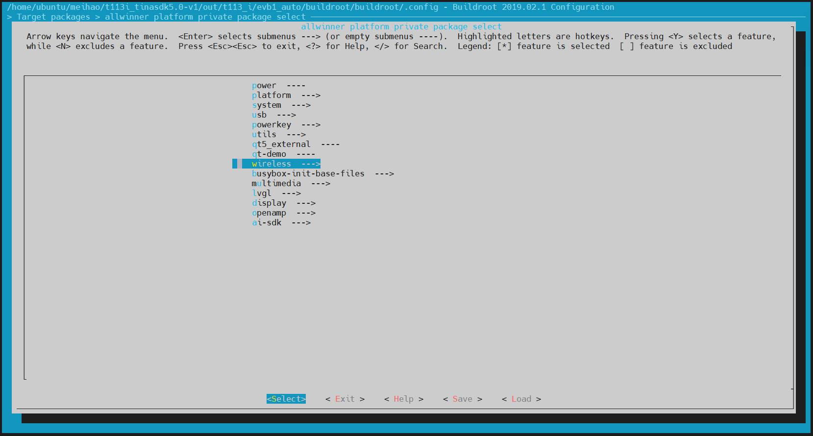
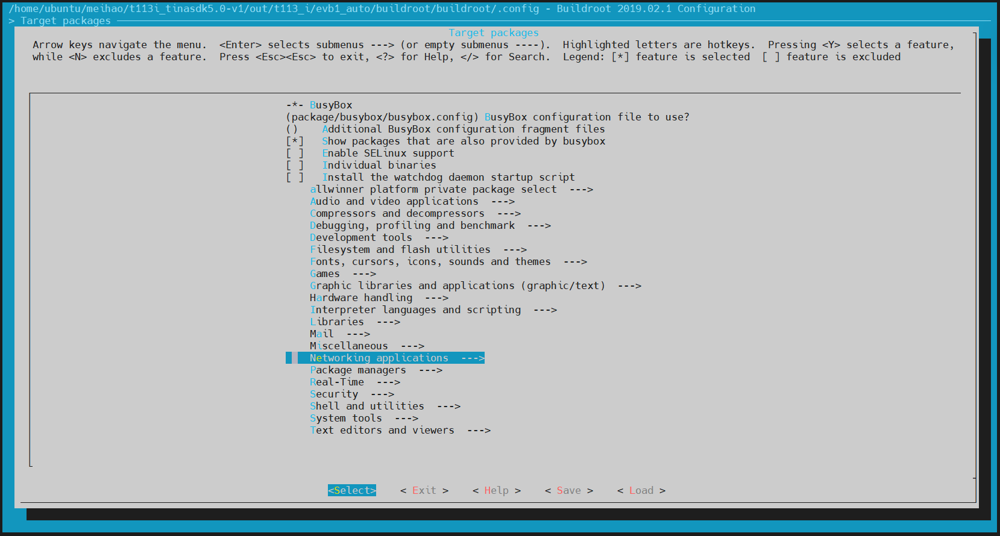

# XR829芯片适配

本章节来讲解如何适配XR829芯片，连接wifi进行上网和连接蓝牙。

## 1.修改内核设备树

**查看原理图**

对于wifi功能需要查看的引脚：

由图可知，

`WL_REG_ON`   对应的引脚是 ==> `PB12`

`WL_WAKE_AP` 对应的引脚是 ==> `PG10`

对于蓝牙功能需要查看的引脚：

由图可知，

`BT_RST_N` 对应的引脚是 ==> `PG18`

**修改设备树**

进入目录`t113i_tinasdk5.0-v1/device/config/chips/t113_i/configs/evb1_auto/linux-5.4`

修改内核设备树文件`board.dts`

~~~bash
vim board.dts
~~~

对于wifi设备树节点修改对应的引脚：

在普通模式下，键盘输入`/wlan`，找到wlan设备树节点，修改如下：

对于蓝牙设备树节点修改对应的引脚：

在普通模式下，键盘输入`/bt`，找到蓝牙设备树节点，修改如下：

## 2.添加内核驱动

进入SDK源码目录`t113i_tinasdk5.0-v1$`

执行`./build.sh menuconfig`进入内核配置界面。

找到`Device Drivers`，进入。

找到` Network device support`，进入。

找到` Wireless LAN`，进入。

找到`XR829 WLAN support`，按住键盘M，选为编译成内核模块。

保存退出。

在SDK源码目录`t113i_tinasdk5.0-v1$`下，执行`./build.sh kernel`

~~~bash
ubuntu@dshanpi:~/meihao/t113i_tinasdk5.0-v1$ ./build.sh kernel
========ACTION List: build_kernel ;========
options :
INFO: build kernel ...
INFO: prepare_buildserver
INFO: Prepare toolchain ...
Building kernel
...
Copy boot.img to output directory ...

sun8iw20p1 compile all(Kernel+modules+boot.img) successful

INFO: build dts ...
INFO: Prepare toolchain ...
removed '/home/ubuntu/meihao/t113i_tinasdk5.0-v1/out/t113_i/evb1_auto/buildroot/.board.dtb.d.dtc.tmp'
removed '/home/ubuntu/meihao/t113i_tinasdk5.0-v1/out/t113_i/evb1_auto/buildroot/.board.dtb.dts.tmp'
'/home/ubuntu/meihao/t113i_tinasdk5.0-v1/out/t113_i/kernel/build/arch/arm/boot/dts/.board.dtb.d.dtc.tmp' -> '/home/ubuntu/meihao/t113i_tinasdk5.0-v1/out/t113_i/evb1_auto/buildroot/.board.dtb.d.dtc.tmp'
'/home/ubuntu/meihao/t113i_tinasdk5.0-v1/out/t113_i/kernel/build/arch/arm/boot/dts/.board.dtb.dts.tmp' -> '/home/ubuntu/meihao/t113i_tinasdk5.0-v1/out/t113_i/evb1_auto/buildroot/.board.dtb.dts.tmp'
'/home/ubuntu/meihao/t113i_tinasdk5.0-v1/out/t113_i/kernel/staging/sunxi.dtb' -> '/home/ubuntu/meihao/t113i_tinasdk5.0-v1/out/t113_i/evb1_auto/buildroot/sunxi.dtb'
ubuntu@dshanpi:~/meihao/t113i_tinasdk5.0-v1$
~~~

## 3.添加xr829固件

在SDK源码目录`t113i_tinasdk5.0-v1$`下，执行`./build.sh buildroot_menuconfig`

找到`Target packages`，进入

找到`allwinner platform private package select`，进入。

找到`wireless`，进入。

找到`firmware`，进入。

先点击键盘`y`，选择`xr829-firmware`，然后选择`xr829_24M`，板子上xr829芯片旁边用的晶振是24M的。

## 4.启动odhcp6c服务

odhcp6c的核心作用在于简化并自动化IPv6网络环境下的地址配置过程，确保设备能够顺利接入并通信。

接着上面的操作，退出到`Target packages`下，找到`Networking applications`，进入。

找到`odhcp6c`，点击键盘`y`，选上。

保存退出。

在SDK源码目录`t113i_tinasdk5.0-v1$`下，执行`./build.sh`

编译完成后，输入`./build.sh pack`

~~~bash
ubuntu@dshanpi:~/meihao/t113i_tinasdk5.0-v1$ ./build.sh pack
========ACTION List: mk_pack ;========
options :
INFO: packing firmware ...
INFO: /home/ubuntu/meihao/t113i_tinasdk5.0-v1/out/t113_i/common/keys
copying tools file
copying configs file
copying product configs file
linux copying boardt&linux_kernel_version configs file
...
update gpt file ok
update mbr file ok
/home/ubuntu/meihao/t113i_tinasdk5.0-v1/tools/pack/pctools/linux/eDragonEx/
/home/ubuntu/meihao/t113i_tinasdk5.0-v1/out/t113_i/evb1_auto/pack_out
Begin Parse sys_partion.fex
Add partion boot-resource.fex BOOT-RESOURCE_FEX
Add partion very boot-resource.fex BOOT-RESOURCE_FEX
FilePath: boot-resource.fex
FileLength=dad400Add partion env.fex ENV_FEX000000000
Add partion very env.fex ENV_FEX000000000
FilePath: env.fex
FileLength=20000Add partion env.fex ENV_FEX000000000
Add partion very env.fex ENV_FEX000000000
FilePath: env.fex
FileLength=20000Add partion boot.fex BOOT_FEX00000000
Add partion very boot.fex BOOT_FEX00000000
FilePath: boot.fex
FileLength=920800Add partion rootfs.fex ROOTFS_FEX000000
Add partion very rootfs.fex ROOTFS_FEX000000
FilePath: rootfs.fex
FileLength=b260880Add partion amp_rv0.fex AMP_RV0_FEX00000
Add partion very amp_rv0.fex AMP_RV0_FEX00000
FilePath: amp_rv0.fex
FileLength=29eb8BuildImg 0
Dragon execute image.cfg SUCCESS !
----------image is at----------

266M    /home/ubuntu/meihao/t113i_tinasdk5.0-v1/out/t113_i_linux_evb1_auto_uart0.img

pack finish
ubuntu@dshanpi:~/meihao/t113i_tinasdk5.0-v1$
~~~

打包完成后，根据之前的烧录方式烧录到开发板上。

## 5.上网测试

在开发板上，执行`ifconfig -a`

~~~bash
# ifconfig -a
awlink0   Link encap:UNSPEC  HWaddr 00-00-00-00-00-00-00-00-00-00-00-00-00-00-00-00
          NOARP  MTU:16  Metric:1
          RX packets:0 errors:0 dropped:0 overruns:0 frame:0
          TX packets:0 errors:0 dropped:0 overruns:0 carrier:0
          collisions:0 txqueuelen:10
          RX bytes:0 (0.0 B)  TX bytes:0 (0.0 B)
          Interrupt:255

awlink1   Link encap:UNSPEC  HWaddr 00-00-00-00-00-00-00-00-00-00-00-00-00-00-00-00
          NOARP  MTU:16  Metric:1
          RX packets:0 errors:0 dropped:0 overruns:0 frame:0
          TX packets:0 errors:0 dropped:0 overruns:0 carrier:0
          collisions:0 txqueuelen:10
          RX bytes:0 (0.0 B)  TX bytes:0 (0.0 B)

eth0      Link encap:Ethernet  HWaddr 9A:47:64:F5:A8:4E
          BROADCAST MULTICAST  MTU:1500  Metric:1
          RX packets:0 errors:0 dropped:0 overruns:0 frame:0
          TX packets:0 errors:0 dropped:0 overruns:0 carrier:0
          collisions:0 txqueuelen:1000
          RX bytes:0 (0.0 B)  TX bytes:0 (0.0 B)
          Interrupt:40

ip6tnl0   Link encap:UNSPEC  HWaddr 00-00-00-00-00-00-00-00-00-00-00-00-00-00-00-00
          NOARP  MTU:1452  Metric:1
          RX packets:0 errors:0 dropped:0 overruns:0 frame:0
          TX packets:0 errors:0 dropped:0 overruns:0 carrier:0
          collisions:0 txqueuelen:1000
          RX bytes:0 (0.0 B)  TX bytes:0 (0.0 B)

lo        Link encap:Local Loopback
          inet addr:127.0.0.1  Mask:255.0.0.0
          inet6 addr: ::1/128 Scope:Host
          UP LOOPBACK RUNNING  MTU:65536  Metric:1
          RX packets:0 errors:0 dropped:0 overruns:0 frame:0
          TX packets:0 errors:0 dropped:0 overruns:0 carrier:0
          collisions:0 txqueuelen:1000
          RX bytes:0 (0.0 B)  TX bytes:0 (0.0 B)

sit0      Link encap:IPv6-in-IPv4
          NOARP  MTU:1480  Metric:1
          RX packets:0 errors:0 dropped:0 overruns:0 frame:0
          TX packets:0 errors:0 dropped:0 overruns:0 carrier:0
          collisions:0 txqueuelen:1000
          RX bytes:0 (0.0 B)  TX bytes:0 (0.0 B)

#
~~~

可以看到目前没有wlan接口，需要加载wifi驱动模块。

执行`insmod /lib/modules/5.4.61/xr829.ko`

~~~bash
# insmod /lib/modules/5.4.61/xr829.ko
[  173.496018] ======== XRADIO WIFI OPEN ========
[  173.501856] [XRADIO] Driver Label:XR_V02.16.88_P2P_HT40_01.31
[  173.508696] [XRADIO] Allocated hw_priv @ (ptrval)
[  173.514978] sunxi-rfkill soc@3000000:rfkill@0: bus_index: 1
[  173.531312] sunxi-rfkill soc@3000000:rfkill@0: wlan power on success
[  173.738498] sunxi-mmc 4021000.sdmmc: sdc set ios:clk 0Hz bm PP pm UP vdd 21 width 1 timing LEGACY(SDR12) dt B
[  173.746231] [XRADIO] Detect SDIO card 1
[  173.749727] sunxi-mmc 4021000.sdmmc: no vqmmc,Check if there is regulator
[  173.774101] sunxi-mmc 4021000.sdmmc: sdc set ios:clk 400000Hz bm PP pm ON vdd 21 width 1 timing LEGACY(SDR12) dt B
[  173.797213] sunxi-mmc 4021000.sdmmc: sdc set ios:clk 400000Hz bm PP pm ON vdd 21 width 1 timing LEGACY(SDR12) dt B
[  173.811824] sunxi-mmc 4021000.sdmmc: sdc set ios:clk 400000Hz bm PP pm ON vdd 21 width 1 timing LEGACY(SDR12) dt B
[  173.834060] sunxi-mmc 4021000.sdmmc: sdc set ios:clk 400000Hz bm PP pm ON vdd 21 width 1 timing SD-HS(SDR25) dt B
[  173.845657] sunxi-mmc 4021000.sdmmc: sdc set ios:clk 50000000Hz bm PP pm ON vdd 21 width 1 timing SD-HS(SDR25) dt B
[  173.857505] sunxi-mmc 4021000.sdmmc: sdc set ios:clk 50000000Hz bm PP pm ON vdd 21 width 4 timing SD-HS(SDR25) dt B
[  173.870081] mmc1: new high speed SDIO card at address 0001
[  173.877097] [SBUS] XRadio Device:sdio clk=50000000
[  173.890482] [XRADIO] XRADIO_HW_REV 1.0 detected.
[  173.947031] [XRADIO] xradio_update_dpllctrl: DPLL_CTRL Sync=0x01400000.
[  173.980161] [XRADIO] Bootloader complete
[  174.002859] random: crng init done
[  174.006676] random: 2 urandom warning(s) missed due to ratelimiting
[  174.094363] [XRADIO] Firmware completed.
[  174.100603] [WSM] Firmware Label:XR_C09.08.52.64_DBG_02.100 2GHZ HT40 Jan  3 2020 13:14:37
[  174.109975] [XRADIO] Firmware Startup Done.
[  174.114975] [XRADIO_WRN] enable Multi-Rx!
[  174.122681] ieee80211 phy0: Selected rate control algorithm 'minstrel_ht'
#
~~~

再次执行`ifconfig -a`，可以看到wlan0这个接口了。

输入`ifconfig wlan0 up`，使能wlan0接口。

~~~bash
# ifconfig wlan0 up
[  324.579646] ieee80211_do_open: vif_type=2, p2p=0, ch=3, addr=f8:f2:1a:3e:86:2e
[  324.587897] [STA] !!!xradio_vif_setup: id=0, type=2, p2p=0, addr=f8:f2:1a:3e:86:2e
[  324.603169] [AP_WRN] BSS_CHANGED_ASSOC but driver is unjoined.
# ifconfig
lo        Link encap:Local Loopback
          inet addr:127.0.0.1  Mask:255.0.0.0
          inet6 addr: ::1/128 Scope:Host
          UP LOOPBACK RUNNING  MTU:65536  Metric:1
          RX packets:0 errors:0 dropped:0 overruns:0 frame:0
          TX packets:0 errors:0 dropped:0 overruns:0 carrier:0
          collisions:0 txqueuelen:1000
          RX bytes:0 (0.0 B)  TX bytes:0 (0.0 B)

wlan0     Link encap:Ethernet  HWaddr F8:F2:1A:3E:86:2E
          UP BROADCAST MULTICAST  MTU:1500  Metric:1
          RX packets:0 errors:0 dropped:0 overruns:0 frame:0
          TX packets:0 errors:0 dropped:0 overruns:0 carrier:0
          collisions:0 txqueuelen:1000
          RX bytes:0 (0.0 B)  TX bytes:0 (0.0 B)
~~~

**扫描wifi**

输入以下内容：

~~~bash
iw dev wlan0 scan | grep SSID
~~~

扫描附近的wifi节点：

~~~bash
# iw dev wlan0 scan | grep SSID
        SSID: Programmers
                 * SSID List
        SSID: ChinaNet-kRAH
        SSID: \xe9\xa1\xba\xe6\x88\x90\xe5\x8a\xb3\xe5\x8a\xa1
        SSID: Voform
        SSID: Guest_An
        SSID: Redmi_83D1
        SSID: pobo
                 * SSID List
        SSID: ChinaNet-ec7h
        SSID: ChinaNet-ccXn
        SSID: MERCURY_62A2
        SSID:
        SSID: ChinaNet-sqJr
        SSID: VANTEN
                 * SSID List
        SSID: HUAWEI-1619
        SSID: HUAWEI-yuanyuan
        SSID:
        SSID:
        SSID: WiFi
~~~

**连接wifi**

wpa_supplicant连接WIFI的时候会从配置文件中读取账号和密码，以及加密方式等， 所以我们再运行wpa_supplicant工具的时候要提前写好配置文件。
配置文件名称自定，但是要以 .conf 为后缀，并保存在 /etc/ 目录下，这边给出一个配置文件的例子。

~~~bash
vim /etc/wpa_supplicant.conf
~~~

添加如下内容：

~~~bash
ctrl_interface=/var/run/wpa_supplicant
update_config=1

network={
        ssid="Programmers"
        psk="100askxxx"
}
~~~

创建一个socket通信的目录

~~~bash
mkdir -p /var/log/wpa_supplicant
~~~

连接到 SSID

~~~bash
wpa_supplicant -B -c /etc/wpa_supplicant.conf -i wlan0
~~~

打印信息如下：

~~~bash
# wpa_supplicant -B -c /etc/wpa_supplicant.conf -i wlan0
Successfully initialized wpa_supplicant
[  762.072364] ieee80211_do_open: vif_type=10, p2p=0, ch=3, addr=f8:f2:1a:3e:86:2f
[  762.080682] [STA] !!!xradio_vif_setup: id=2, type=10, p2p=0, addr=f8:f2:1a:3e:86:2f
# [  763.621943] [STA_WRN] Freq 2442 (wsm ch: 7) prev: 3.
[  763.627544] wlan0: authenticate with 94:d9:b3:b7:c9:0a (try 1)
[  763.640709] [STA_WRN] [HT40][xradio_join_work][bss_ht_info]:
[  763.640709] [primary_chan  :0x00000007]
[  763.640709] [ht_param      :0x0000000f]
[  763.640709] [operation_mode:0x00000006]
[  763.640709] [stbc_param    :0x00000000]
[  763.640709] [basic_set[0]  :0x00000000]
[  763.668482] [STA_WRN] [HT40][xradio_join_work][PhyModeCfg:0x0027]
[  763.668482] [ModemFlags    :0x00000007]
[  763.668482] [ChWidthCfg    :0x00000002]
[  763.668482] [PriChCfg      :0x00000000]
[  763.668482] [BandCfg       :0x00000000]
[  763.668482] [STBC_Enable   :0x00000000]
[  763.668482] [PreambleCfg   :0x00000000]
[  763.668482] [SGI_Enable    :0x00000000]
[  763.668482] GF_Enable      :0x00000000]
[  763.737620] wlan0: authenticated
[  763.741576] [STA_WRN] Freq 2422 (wsm ch: 3) prev: 7.
[  763.747343] [AP_WRN] xradio_bss_info_changed vif(type=3) is not enable!changed=0x200
[  763.756080] [STA_WRN] Freq 2442 (wsm ch: 7) prev: 3.
[  763.761794] wlan0: associate with 94:d9:b3:b7:c9:0a (try 1)
[  763.805085] wlan0: RX AssocResp from 94:d9:b3:b7:c9:0a (capab=0x431 status=0 aid=7)
[  763.813721] wlan0: associated
[  763.820299] [AP_WRN] [STA] ASSOC HTCAP 11N 58
[  763.825180] [AP_WRN] [HT40][xradio_bss_info_changed][ht_prot:0x0000000a][HtProtMode:0x0002][Green:0x0004]
[  763.825406] [AP_WRN] [HT40][xradio_bss_info_changed][PhyModeCfg:0x5027]
[  763.825406] [ModemFlags    :0x00000007]
[  763.825406] [ChWidthCfg    :0x00000002]
[  763.825406] [PriChCfg      :0x00000000]
[  763.825406] [BandCfg       :0x00000000]
[  763.825406] [STBC_Enable   :0x00000000]
[  763.825406] [PreambleCfg   :0x00000001]
[  763.825406] [SGI_Enable    :0x00000001]
[  763.825406] [GF_Enable     :0x00000000]
[  763.880752] [AP_WRN] xradio_bss_info_changed vif(type=3) is not enable!changed=0x200
[  763.918906] IPv6: ADDRCONF(NETDEV_CHANGE): wlan0: link becomes ready

~~~

为 WLAN 接口分配IP地址

~~~bash
udhcpc -i wlan0
~~~

打印信息如下：

~~~bash
# udhcpc -i wlan0
udhcpc: started, v1.33.2
udhcpc: sending discover
[  913.170444] [TXRX_WRN] drop=1773, fctl=0x00d0.
udhcpc: sending select for 192.168.0.104
udhcpc: lease of 192.168.0.104 obtained, lease time 122
deleting routers
adding dns 192.168.0.1
adding dns 192.168.0.1
#
~~~

检查连接性

~~~bash
# ifconfig
lo        Link encap:Local Loopback
          inet addr:127.0.0.1  Mask:255.0.0.0
          inet6 addr: ::1/128 Scope:Host
          UP LOOPBACK RUNNING  MTU:65536  Metric:1
          RX packets:0 errors:0 dropped:0 overruns:0 frame:0
          TX packets:0 errors:0 dropped:0 overruns:0 carrier:0
          collisions:0 txqueuelen:1000
          RX bytes:0 (0.0 B)  TX bytes:0 (0.0 B)

wlan0     Link encap:Ethernet  HWaddr F8:F2:1A:3E:86:2E
          inet addr:192.168.0.104  Bcast:192.168.0.255  Mask:255.255.255.0
          inet6 addr: fe80::faf2:1aff:fe3e:862e/64 Scope:Link
          UP BROADCAST RUNNING MULTICAST  MTU:1500  Metric:1
          RX packets:2243 errors:0 dropped:9 overruns:0 frame:0
          TX packets:20 errors:0 dropped:0 overruns:0 carrier:0
          collisions:0 txqueuelen:1000
          RX bytes:219959 (214.8 KiB)  TX bytes:3036 (2.9 KiB)
# ping www.baidu.com
PING www.baidu.com (183.2.172.185): 56 data bytes
64 bytes from 183.2.172.185: seq=0 ttl=52 time=9.954 ms
64 bytes from 183.2.172.185: seq=1 ttl=52 time=10.585 ms
64 bytes from 183.2.172.185: seq=2 ttl=52 time=8.143 ms
^C
--- www.baidu.com ping statistics ---
3 packets transmitted, 3 packets received, 0% packet loss
round-trip min/avg/max = 8.143/9.560/10.585 ms
#
~~~

> 注意：输入 `<CTRL + C>` 可终止 ping 会话。

## 6.蓝牙测试

开机进入开发板，执行`bt_test -i`，发现蓝牙起不来，报错。

查看`/etc/bluetooth/bt_init.sh`

~~~bash
start_hci_attach()
{
        h=`ps | grep "$bt_hciattach" | grep -v grep`
        [ -n "$h" ] && {
                killall "$bt_hciattach"
        }

        # reset_bluetooth_power

        "$bt_hciattach" -n ttyAS1 xradio >/dev/null 2>&1 &

        wait_hci0_count=0
        while true
        do
                [ -d /sys/class/bluetooth/hci0 ] && break
                usleep 100000
                let wait_hci0_count++
                [ $wait_hci0_count -eq 70 ] && {
                        echo "bring up hci0 failed"
                        exit 1
                }
        done
}
~~~

发现脚本有错：`"$bt_hciattach" -n ttyAS1 xradio >/dev/null 2>&1 &`

串口1的设备节点是`/dev/ttyS1`：

~~~bash
# ls /dev/tty
tty    tty14  tty20  tty27  tty33  tty4   tty46  tty52  tty59  tty8
tty0   tty15  tty21  tty28  tty34  tty40  tty47  tty53  tty6   tty9
tty1   tty16  tty22  tty29  tty35  tty41  tty48  tty54  tty60  ttyS0
tty10  tty17  tty23  tty3   tty36  tty42  tty49  tty55  tty61  ttyS1
tty11  tty18  tty24  tty30  tty37  tty43  tty5   tty56  tty62  ttyS2
tty12  tty19  tty25  tty31  tty38  tty44  tty50  tty57  tty63  ttyS3
tty13  tty2   tty26  tty32  tty39  tty45  tty51  tty58  tty7
# ls /dev/tty
~~~

修改如下：

~~~bash
start_hci_attach()
{
        h=`ps | grep "$bt_hciattach" | grep -v grep`
        [ -n "$h" ] && {
                killall "$bt_hciattach"
        }

        # reset_bluetooth_power

        "$bt_hciattach" -n ttyS1 xradio >/dev/null 2>&1 &

        wait_hci0_count=0
        while true
        do
                [ -d /sys/class/bluetooth/hci0 ] && break
                usleep 100000
                let wait_hci0_count++
                [ $wait_hci0_count -eq 70 ] && {
                        echo "bring up hci0 failed"
                        exit 1
                }
        done
}
~~~

重启开发板。

再次执行`bt_test -i`

~~~bash
# bt_test -i
[ACT D][ring_buff_init,27]enter

[ACT D][ring_buff_start,173]ring buffer start enter

[ACT D][ring_buff_start,187]ring buffer start quit

[ACT D][ring_buff_init,27]enter

[ACT D][ring_buff_start,173]ring buffer start enter

[ACT D][ring_buff_start,187]ring buffer start quit

1970-01-01 09:55:24:756: BTMG[_bt_manager_set_default_profile:374]:  enable default profile from bt config
1970-01-01 09:55:24:756: BTMG[_bt_manager_enable:258]:  btmanager version: Version:4.0.4.20231208, builed time: Jul 16 2024-16:53:44
1970-01-01 09:55:24:756: BTMG[_bt_manager_enable:259]:  enable state: 1, now bt adapter state : 0
197[  286.262531] sunxi-rfkill soc@3000000:rfkill@0: block state already is 1
0-01-01 09:55:24:757: BTMG[bt_test_adapter_status_cb:74]:  bt is turnning on.
[  286.471759] sunxi-rfkill soc@3000000:rfkill@0: set block: 0
[  286.488049] sunxi-rfkill soc@3000000:rfkill@0: bt power on success
[  286.515417] [XR_BT_LPM] bluedroid_write_proc_btwake: bluedroid_write_proc_btwake 1
[  286.523960] [XR_BT_LPM] bluedroid_write_proc_btwake: wakeup bt device
[  286.531339] [XR_BT_LPM] bluedroid_write_proc_lpm: disable lpm mode
Starting bluetoothd: OK
1970-01-01 09:55:29:953: BTMG[bt_routine:102]:  bt adapter info:
             address:6E:D6:22:1F:82:27
             Name: BlueZ 5.54
             Alias: aw-bt-test-82-27
             Discoverable: 1
             DiscoverableTimeout: 180

[ACT D][ring_buff_init,27]enter

1970-01-01 09:55:30:199: BTMG[bt_test_adapter_status_cb:59]:  BT is ON
1970-01-01 09:55:30:202: BTMG[bt_agent_register:226]:  set io capability: KeyboardDisplay
1970-01-01 09:55:30:208: BTMG[bt_manager_set_scan_mode:208]:  enter
1970-01-01 09:55:30:209: BTMG[pfd1_thread_process:1008]:  enter
[BT]:
~~~

成功，手机可以连接上蓝牙了。

打印信息如下：

~~~bash
[BT]:1970-01-01 09:56:01:896: BTMG[bt_test_agent_authorize_service_cb:192]:  AGENT: 04:10:6B:F9:43:23 Authorize Service 0000110d-0000-1000-8000-00805f9b34fb
1970-01-01 09:56:02:183: BTMG[supervise_pcm_worker_start:131]:  transport A2DP:AAC
1970-01-01 09:56:02:184: BTMG[a2dp_pcm_worker_routine:115]:  codec:AAC, sampling:44100, channels:2, format_size:2
1970-01-01 09:56:02:191: BTMG[a2dp_pcm_worker_routine:149]:  Starting PCM loop
1970-01-01 09:56:02:545: BTMG[bt_test_agent_authorize_service_cb:192]:  AGENT: 04:10:6B:F9:43:23 Authorize Service 0000110e-0000-1000-8000-00805f9b34fb
1970-01-01 09:56:02:590: BTMG[bt_test_a2dp_sink_connection_state_cb:205]:  A2DP sink connected with device: 04:10:6B:F9:43:23
1970-01-01 09:56:02:626: BTMG[bluez_signal_mediatransport_properties_changed:506]:  Volume is :59
1970-01-01 09:56:02:626: BTMG[bt_test_avrcp_audio_volume_cb:287]:  AVRCP audio volume:04:10:6B:F9:43:23 : 59
1970-01-01 09:56:03:058: BTMG[bt_test_avrcp_play_state_cb:260]:  BT palying music paused with device: 04:10:6B:F9:43:23
1970-01-01 09:56:03:061: BTMG[bt_test_avrcp_track_changed_cb:276]:  BT playing music title: Not Provided
1970-01-01 09:56:03:061: BTMG[bt_test_avrcp_track_changed_cb:277]:  BT playing music artist:
1970-01-01 09:56:03:061: BTMG[bt_test_avrcp_track_changed_cb:278]:  BT playing music album:

[BT]:
~~~

