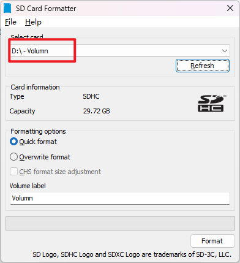
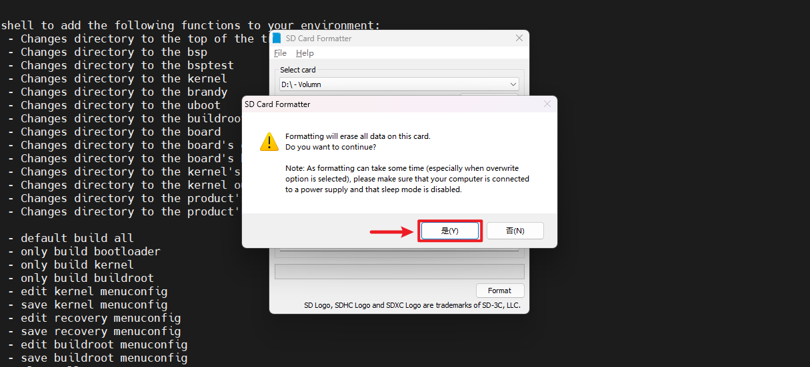
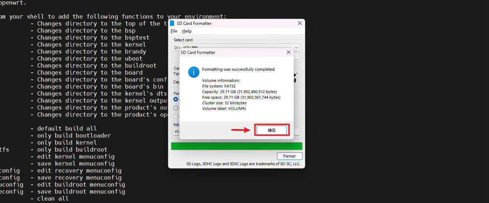
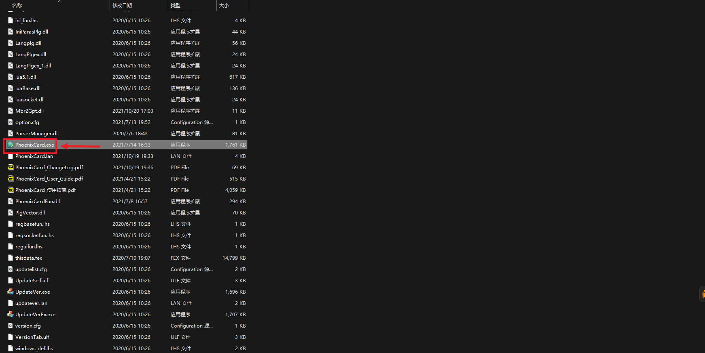
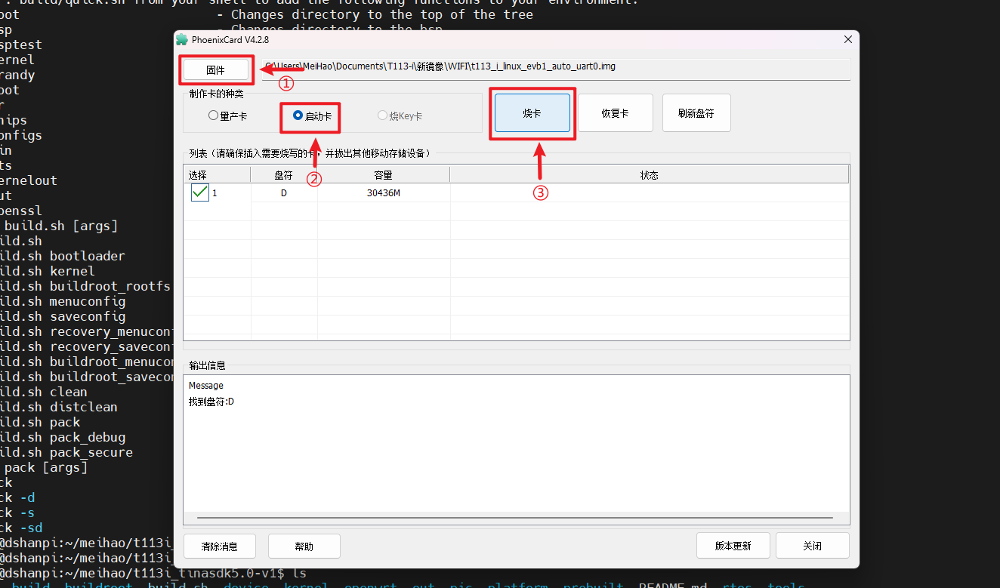
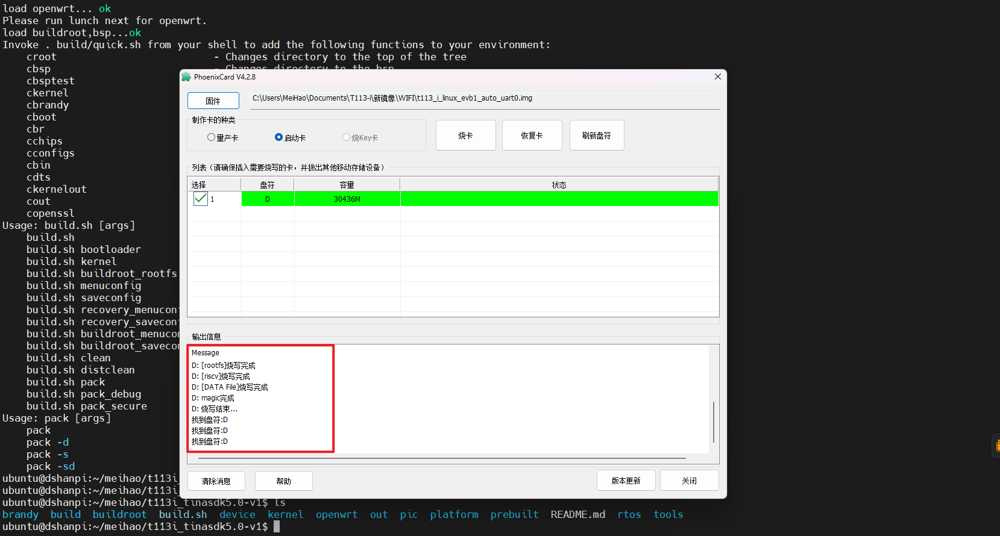
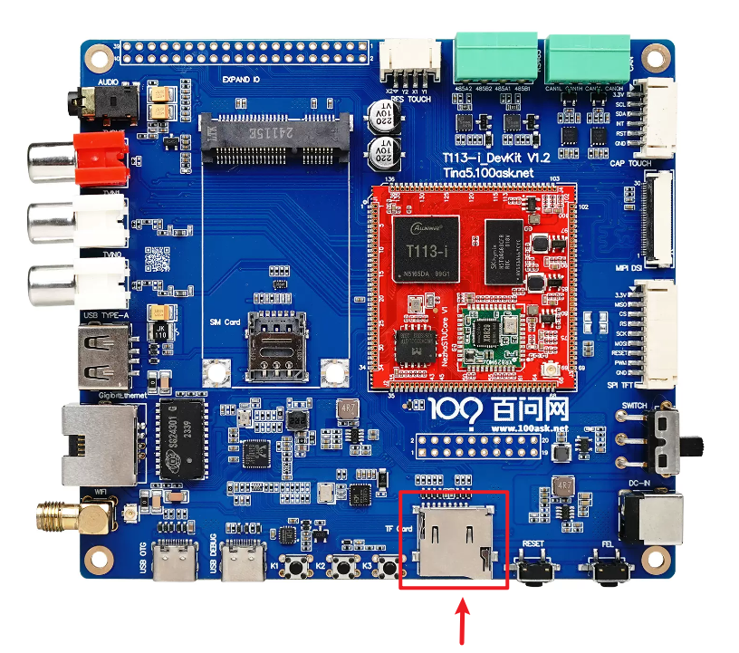

# 支持TF启动

本章节讲解如何把镜像烧录到TF上，并开机启动。根据开发环境搭建章节，编译出的镜像默认支持TF卡功能。

## 1.格式化TF卡

准备一张TF卡，打开格式化工具，这里使用的是**SD Card Formatter**

选择相应的TF卡，点击格式化`Format`。

选择`是`。

格式化成功，选择`确定`即可格式化完成。

## 2.烧录镜像

烧录全志的镜像，需要使用全志官方提供的烧录工具 **PhoenixCard**，双击打开。

点击**①固件**。找到相应的镜像，开发环境搭建章节编译出的固件支持烧录到emmc和TF。

选择**②启动卡**。

点击**③烧卡**。

等待烧写完成即可。

## 3.启动镜像

烧写完成后，把TF插入开发板中，开发板TF卡槽位置如下：

默认TF启动优先级大于emmc启动。所以插入TF卡，上电时，默认TF启动镜像。

串口打印信息如下：

~~~bash
[198]HELLO! BOOT0 is starting!
[201]BOOT0 commit : 069ed30b88
[204]set pll start
[206]fix vccio detect value:0xc0
[214]periph0 has been enabled
[217]set pll end
[218][pmu]: bus read error
[221]board init ok
[223]enable_jtag
[224]get_pmu_exist() = -1
[227]ddr_efuse_type: 0x0
[229]trefi:7.8ms
[232][AUTO DEBUG] single rank and full DQ!
[236]ddr_efuse_type: 0x0
[238]trefi:7.8ms
[241][AUTO DEBUG] rank 0 row = 15
[244][AUTO DEBUG] rank 0 bank = 8
[247][AUTO DEBUG] rank 0 page size = 2 KB
[251]DRAM BOOT DRIVE INFO: V0.34
[255]DRAM CLK = 792 MHz
[257]DRAM Type = 3 (2:DDR2,3:DDR3)
[260]DRAMC ZQ value: 0x7b7bfb
[263]DRAM ODT value: 0x42.
[266]ddr_efuse_type: 0x0
[269]DRAM SIZE = 512 MB
[276]DRAM simple test OK.
[278]rtc standby flag is 0x0, super standby flag is 0x0
[283]dram size =512
[286]card no is 0
[288]sdcard 0 line count 4
[290][mmc]: mmc driver ver 2021-05-21 14:47
[299][mmc]: Wrong media type 0x0
[302][mmc]: ***Try SD card 0***
[323][mmc]: HSSDR52/SDR25 4 bit
[326][mmc]: 50000000 Hz
[328][mmc]: 30436 MB
[330][mmc]: ***SD/MMC 0 init OK!!!***
[426]Loading boot-pkg Succeed(index=0).
[430]Entry_name        = u-boot
[437]Entry_name        = optee
[441]Entry_name        = dtb
[444]mmc not para
[445]Jump to second Boot.
M/TC: OP-TEE version: 2a99a16f (gcc version 5.3.1 20160412 (Linaro GCC 5.3-2016.05)) #1 Thu Aug 17 11:13:02 UTC 2023 arm
E/TC:0 0 platform_standby_fdt_parse:126 no pmu0 node
E/TC:0 0 sunxi_twi_parse_from_dt:121 no pmu node

U-Boot 2018.07-g6047f84-dirty (Jul 20 2024 - 14:56:41 +0800) Allwinner Technology

[00.516]CPU:   Allwinner Family
[00.519]Model: sun8iw20
[00.521]DRAM:  512 MiB
[00.525]Relocation Offset is: 1cebd000
[00.553]secure enable bit: 0
E/TC:0   fdt_getprop_u32:336 prop trace_level not found
[00.566]CPU=1008 MHz,PLL6=600 Mhz,AHB=200 Mhz, APB1=100Mhz  MBus=300Mhz
[00.572]gic: sec monitor mode
SPI ALL:   ready
[00.578]line:703 init_clocks
[00.581]flash init start
[00.583]workmode = 0,storage type = 1
[00.586][mmc]: mmc driver ver uboot2018:2023-07-4 16:18:00
[00.592][mmc]: get sdc_type fail and use default host:tm1.
[00.598][mmc]: can't find node "mmc0",will add new node
[00.602][mmc]: fdt err returned <no error>
[00.606][mmc]: Using default timing para
[00.610][mmc]: SUNXI SDMMC Controller Version:0x50310
[00.638][mmc]: card_caps:0x3000000a
[00.641][mmc]: host_caps:0x3000003f
[00.646]sunxi flash init ok
get value error
[00.650]drv_disp_init
partno erro : can't find partition bootloader
** Unable to read file lcd_compatible_index.txt **
[00.676]disp_fat_load for lcd config failed
[00.704]drv_disp_init finish
[00.713]Loading Environment from SUNXI_FLASH... OK
[00.732]boot_gui_init:start
partno erro : can't find partition Reserve0
[00.739]lcd_open_flow
[00.742]lcd_cfg_panel_info
[00.745]lcd_power_on
bad fb1_cfg[w=0,h=0,bpp=32,format=0]
[00.775]boot_gui_init:finish
partno erro : can't find partition bootloader
[00.784]bmp_name=bootlogo.bmp size 1152054
[00.845]Item0 (Map) magic is bad
[00.848]the secure storage item0 copy0 magic is bad
[00.853]Item0 (Map) magic is bad
[00.855]the secure storage item0 copy1 magic is bad
[00.860]Item0 (Map) magic is bad
secure storage read widevine fail
secure storage read ec_key fail
secure storage read ec_cert1 fail
secure storage read ec_cert2 fail
secure storage read ec_cert3 fail
secure storage read rsa_key fail
secure storage read rsa_cert1 fail
secure storage read rsa_cert2 fail
secure storage read rsa_cert3 fail
[00.890]u[00.891] tft08006 drivers/video/sunxi/disp2/disp/lcd/tft08006.c lcd_panel_init 162
[00.898]lcd_panel_init
sb burn from boot
delay time 0
weak:otg_phy_config
[01.384]usb prepare ok
[01.435]lcd_bl_open
[01.438]LCD open finish
[01.688]overtime
[01.691]do_burn_from_boot usb : no usb exist
List file under ULI/factory
** Unrecognized filesystem type **
[01.702]update part info
[01.705]update bootcmd
[01.711]change working_fdt 0x5c87ce68 to 0x5c85ce68
get value error
[01.717][mmc]: get sunxi-mmc0 string failed
[01.722]The storage not support sample function
partno erro : can't find partition bootloader
** Unable to read file lcd_compatible_index.txt **
[01.755]disp_fat_load for lcd config failed
partno erro : can't find partition bootloader
writing lcd_compatible_index.txt
16 bytes written
save lcd compatible disp0 index 0 to flash
partno erro : can't find partition bootloader
[01.793]update dts
Hit any key to stop autoboot:  0
[02.205]no vendor_boot partition is found
Android's image name: sun8i_arm
The loading address of the kernel is not in the boot image
ERROR: reserving fdt memory region failed (addr=41b00000 size=100000)
ERROR: reserving fdt memory region failed (addr=5c907000 size=177000)
[02.254]Starting kernel ...

[02.256][mmc]: MMC Device 2 not found
[02.260][mmc]: mmc 2 not find, so not exit
[    0.000000] Booting Linux on physical CPU 0x0
[    0.000000] Linux version 5.4.61 (ubuntu@dshanpi) (arm-linux-gnueabi-gcc (Linaro GCC 5.3-2016.05) 5.3.1 20160412, GNU ld (Linaro_Binutils-2016.05) 2.25.0 Linaro 2016_02) #14 SMP PREEMPT Mon Jul 22 11:47:15 CST 2024
[    0.000000] CPU: ARMv7 Processor [410fc075] revision 5 (ARMv7), cr=10c5387d
[    0.000000] CPU: div instructions available: patching division code
[    0.000000] CPU: PIPT / VIPT nonaliasing data cache, VIPT aliasing instruction cache
[    0.000000] OF: fdt: Machine model: sun8iw20
[    0.000000] Memory policy: Data cache writealloc
[    0.000000] Reserved memory: created DMA memory pool at 0x42200000, size 0 MiB
[    0.000000] OF: reserved mem: initialized node vdev0buffer@42200000, compatible id shared-dma-pool
[    0.000000] Reserved memory: created DMA memory pool at 0x42244000, size 0 MiB
[    0.000000] OF: reserved mem: initialized node dsp0_rpbuf@42244000, compatible id shared-dma-pool
[    0.000000] Reserved memory: created DMA memory pool at 0x42900000, size 0 MiB
[    0.000000] OF: reserved mem: initialized node vdev0buffer@42900000, compatible id shared-dma-pool
[    0.000000] cma: Reserved 16 MiB at 0x5f000000
[    0.000000] On node 0 totalpages: 129120
[    0.000000]   Normal zone: 1024 pages used for memmap
[    0.000000]   Normal zone: 0 pages reserved
[    0.000000]   Normal zone: 129120 pages, LIFO batch:31
[    0.000000] psci: probing for conduit method from DT.
[    0.000000] psci: PSCIv1.0 detected in firmware.
[    0.000000] psci: Using standard PSCI v0.2 function IDs
[    0.000000] psci: MIGRATE_INFO_TYPE not supported.
[    0.000000] psci: SMC Calling Convention v1.0
[    0.000000] percpu: Embedded 15 pages/cpu s30976 r8192 d22272 u61440
[    0.000000] pcpu-alloc: s30976 r8192 d22272 u61440 alloc=15*4096
[    0.000000] pcpu-alloc: [0] 0 [0] 1
[    0.000000] Built 1 zonelists, mobility grouping on.  Total pages: 128096
[    0.000000] Kernel command line: earlycon=uart8250,mmio32,0x02500000 clk_ignore_unused initcall_debug=0 console=ttyS0,115200 loglevel=8 root=/dev/mmcblk0p5 rootwait init=/init partitions=boot-resource@mmcblk0p1:env@mmcblk0p2:env-redund@mmcblk0p3:boot@mmcblk0p4:rootfs@mmcblk0p5:riscv@mmcblk0p6:private@mmcblk0p7:UDISK@mmcblk0p8 cma=16M snum= mac_addr= wifi_mac= bt_mac= specialstr= gpt=1 androidboot.mode=normal androidboot.hardware=sun8iw20p1 boot_type=1 androidboot.boot_type=1 gpt=1 uboot_message=2018.07-g6047f84-dirty(07/20/2024-14:56:41) mbr_offset=1032192 disp_reserve=1536000,0x5c907000 androidboot.dramfreq=792 androidboot.dramsize=512 mtdparts=<NULL> uboot_backup=ubootA
[    0.000000] Dentry cache hash table entries: 65536 (order: 6, 262144 bytes, linear)
[    0.000000] Inode-cache hash table entries: 32768 (order: 5, 131072 bytes, linear)
[    0.000000] mem auto-init: stack:off, heap alloc:off, heap free:off
[    0.000000] Memory: 470324K/516480K available (7168K kernel code, 426K rwdata, 2608K rodata, 1024K init, 270K bss, 29772K reserved, 16384K cma-reserved, 0K highmem)
[    0.000000] SLUB: HWalign=64, Order=0-3, MinObjects=0, CPUs=2, Nodes=1
[    0.000000] rcu: Preemptible hierarchical RCU implementation.
[    0.000000]  Tasks RCU enabled.
[    0.000000] rcu: RCU calculated value of scheduler-enlistment delay is 10 jiffies.
[    0.000000] NR_IRQS: 16, nr_irqs: 16, preallocated irqs: 16
[    0.000000] random: get_random_bytes called from start_kernel+0x250/0x3d0 with crng_init=0
[    0.000000] arch_timer: cp15 timer(s) running at 24.00MHz (phys).
[    0.000000] clocksource: arch_sys_counter: mask: 0xffffffffffffff max_cycles: 0x588fe9dc0, max_idle_ns: 440795202592 ns
[    0.000006] sched_clock: 56 bits at 24MHz, resolution 41ns, wraps every 4398046511097ns
[    0.000017] Switching to timer-based delay loop, resolution 41ns
[    0.000203] clocksource: timer: mask: 0xffffffff max_cycles: 0xffffffff, max_idle_ns: 79635851949 ns
[    0.000882] Console: colour dummy device 80x30
[    0.000922] Calibrating delay loop (skipped), value calculated using timer frequency.. 48.00 BogoMIPS (lpj=240000)
[    0.000936] pid_max: default: 32768 minimum: 301
[    0.001092] Mount-cache hash table entries: 1024 (order: 0, 4096 bytes, linear)
[    0.001106] Mountpoint-cache hash table entries: 1024 (order: 0, 4096 bytes, linear)
[    0.001764] CPU: Testing write buffer coherency: ok
[    0.002118] /cpus/cpu@0 missing clock-frequency property
[    0.002141] /cpus/cpu@1 missing clock-frequency property
[    0.002153] CPU0: thread -1, cpu 0, socket 0, mpidr 80000000
[    0.002767] Setting up static identity map for 0x40100000 - 0x40100060
[    0.002896] rcu: Hierarchical SRCU implementation.
[    0.003222] BOOTEVENT:         3.213874: ON
[    0.003429] smp: Bringing up secondary CPUs ...
[    0.004678] CPU1: thread -1, cpu 1, socket 0, mpidr 80000001
[    0.004835] smp: Brought up 1 node, 2 CPUs
[    0.004849] SMP: Total of 2 processors activated (96.00 BogoMIPS).
[    0.004856] CPU: All CPU(s) started in SVC mode.
[    0.005387] devtmpfs: initialized
[    0.019415] VFP support v0.3: implementor 41 architecture 2 part 30 variant 7 rev 5
[    0.020042] clocksource: jiffies: mask: 0xffffffff max_cycles: 0xffffffff, max_idle_ns: 19112604462750000 ns
[    0.020070] futex hash table entries: 512 (order: 3, 32768 bytes, linear)
[    0.020959] pinctrl core: initialized pinctrl subsystem
[    0.022458] NET: Registered protocol family 16
[    0.024567] DMA: preallocated 256 KiB pool for atomic coherent allocations
[    0.064795] rtc_ccu: sunxi ccu init OK
[    0.067424] ccu: sunxi ccu init OK
[    0.067972] r_ccu: sunxi ccu init OK
[    0.109210] sun6i-dma 3002000.dma-controller: sunxi dma probed
[    0.112035] iommu: Default domain type: Translated
[    0.112259] sunxi iommu: irq = 24
[    0.113462] SCSI subsystem initialized
[    0.113853] usbcore: registered new interface driver usbfs
[    0.113936] usbcore: registered new interface driver hub
[    0.114264] usbcore: registered new device driver usb
[    0.114489] mc: Linux media interface: v0.10
[    0.114549] videodev: Linux video capture interface: v2.00
[    0.116982] Advanced Linux Sound Architecture Driver Initialized.
[    0.117727] Bluetooth: Core ver 2.22
[    0.117811] NET: Registered protocol family 31
[    0.117820] Bluetooth: HCI device and connection manager initialized
[    0.117840] Bluetooth: HCI socket layer initialized
[    0.117853] Bluetooth: L2CAP socket layer initialized
[    0.117883] Bluetooth: SCO socket layer initialized
[    0.118140] pwm module init!
[    0.123223] g2d 5410000.g2d: Adding to iommu group 0
[    0.123705] G2D: rcq version initialized.major:250
[    0.124463] input: sunxi-keyboard as /devices/virtual/input/input0
[    0.126214] clocksource: Switched to clocksource arch_sys_counter
[    0.136043] sun8iw20-pinctrl pio: initialized sunXi PIO driver
[    0.150772] thermal_sys: Registered thermal governor 'step_wise'
[    0.150778] thermal_sys: Registered thermal governor 'user_space'
[    0.150795] thermal_sys: Registered thermal governor 'power_allocator'
[    0.151382] NET: Registered protocol family 2
[    0.152125] tcp_listen_portaddr_hash hash table entries: 512 (order: 0, 6144 bytes, linear)
[    0.152158] TCP established hash table entries: 4096 (order: 2, 16384 bytes, linear)
[    0.152216] TCP bind hash table entries: 4096 (order: 3, 32768 bytes, linear)
[    0.152278] TCP: Hash tables configured (established 4096 bind 4096)
[    0.152384] UDP hash table entries: 256 (order: 1, 8192 bytes, linear)
[    0.152420] UDP-Lite hash table entries: 256 (order: 1, 8192 bytes, linear)
[    0.152594] NET: Registered protocol family 1
[    0.155354] Initialise system trusted keyrings
[    0.155600] workingset: timestamp_bits=30 max_order=17 bucket_order=0
[    0.167460] squashfs: version 4.0 (2009/01/31) Phillip Lougher
[    0.167766] ntfs: driver 2.1.32 [Flags: R/W].
[    0.168129] fuse: init (API version 7.31)
[    0.199405] NET: Registered protocol family 38
[    0.199446] Key type asymmetric registered
[    0.199456] Asymmetric key parser 'x509' registered
[    0.199553] Block layer SCSI generic (bsg) driver version 0.4 loaded (major 248)
[    0.199567] io scheduler mq-deadline registered
[    0.199575] io scheduler kyber registered
[    0.199715] atomic64_test: passed
[    0.201334] [DISP]disp_module_init
[    0.201962] disp 5000000.disp: Adding to iommu group 0
[    0.202580] [DISP] disp_init,line:2372:
[    0.202585] smooth display screen:0 type:1 mode:4
[    0.219701] lcd_cfg_panel_info
[    0.219714] tft08006
[    0.219754] display_fb_request,fb_id:0
[    0.225832] disp_al_manager_apply ouput_type:1
[    0.226012] [DISP] lcd_clk_config,line:777:
[    0.226023] disp 0, clk: pll(300000000),clk(300000000),dclk(25000000) dsi_rate(25000000)
[    0.226023]      clk real:pll(300000000),clk(300000000),dclk(75000000) dsi_rate(150000000)
[    0.226503] sun8iw20-pinctrl pio: pio supply vcc-pb not found, using dummy regulator
[    0.226991] [DISP]disp_module_init finish
[    0.228424] sunxi_sid_init()783 - insmod ok
[    0.229162] pwm-regulator: supplied by regulator-dummy
[    0.230898] uart uart0: uart0 supply uart not found, using dummy regulator
[    0.231263] uart0: ttyS0 at MMIO 0x2500000 (irq = 34, base_baud = 1500000) is a SUNXI
[    0.231293] sw_console_setup()1831 - console setup baud 115200 parity n bits 8, flow n
[    0.927605] Freeing logo buffer memory: 1500K
[    0.931580] printk: console [ttyS0] enabled
[    1.165082] sun8iw20-pinctrl pio: pio supply vcc-pg not found, using dummy regulator
[    1.174204] uart uart1: uart1 supply uart not found, using dummy regulator
[    1.182241] uart1: ttyS1 at MMIO 0x2500400 (irq = 35, base_baud = 1500000) is a SUNXI
[    1.191849] uart uart2: uart2 supply uart not found, using dummy regulator
[    1.199913] uart2: ttyS2 at MMIO 0x2500800 (irq = 36, base_baud = 1500000) is a SUNXI
[    1.209519] uart uart3: uart3 supply uart not found, using dummy regulator
[    1.217629] uart3: ttyS3 at MMIO 0x2500c00 (irq = 37, base_baud = 1500000) is a SUNXI
[    1.227557] misc dump reg init
[    1.231499] deinterlace 5400000.deinterlace: Adding to iommu group 0
[    1.239197] deinterlace 5400000.deinterlace: version[1.0.0], ip=0x110
[    1.248108] sunxi-rfkill soc@3000000:rfkill@0: module version: v1.0.9
[    1.255349] sunxi-rfkill soc@3000000:rfkill@0: get gpio chip_en failed
[    1.262682] sunxi-rfkill soc@3000000:rfkill@0: get gpio power_en failed
[    1.270103] sunxi-rfkill soc@3000000:rfkill@0: wlan_busnum (1)
[    1.276625] sunxi-rfkill soc@3000000:rfkill@0: Missing wlan_power.
[    1.283535] sunxi-rfkill soc@3000000:rfkill@0: wlan clock[0] (32k-fanout1)
[    1.291249] sunxi-rfkill soc@3000000:rfkill@0: wlan_regon gpio=44 assert=1
[    1.298979] sunxi-rfkill soc@3000000:rfkill@0: wlan_hostwake gpio=202 assert=1
[    1.307077] sunxi-rfkill soc@3000000:rfkill@0: wakeup source is enabled
[    1.314730] sunxi-rfkill soc@3000000:rfkill@0: Missing bt_power.
[    1.321495] sunxi-rfkill soc@3000000:rfkill@0: bt clock[0] (32k-fanout1)
[    1.329013] sunxi-rfkill soc@3000000:rfkill@0: bt_rst gpio=210 assert=0
[    1.337449] [ADDR_MGT] addr_mgt_probe: module version: v1.0.11
[    1.344654] [ADDR_MGT] addr_init: Failed to get type_def_bt, use default: 0
[    1.352472] [ADDR_MGT] addr_mgt_probe: success.
[    1.359541] libphy: Fixed MDIO Bus: probed
[    1.364117] CAN device driver interface
[    1.369576] sunxi-awlink awlink@0x0: awlink driver probe ok ...
[    1.377262] sunxi-awlink awlink@0x1: awlink driver probe ok ...
[    1.384841] sun8iw20-pinctrl pio: pio supply vcc-pe not found, using dummy regulator
[    1.394018] gmac-power0: NULL
[    1.397369] gmac-power1: NULL
[    1.400675] gmac-power2: NULL
[    1.405188] Failed to alloc md5
[    1.408767] eth0: Use random mac address
[    1.413605] usbcore: registered new interface driver asix
[    1.419753] usbcore: registered new interface driver ax88179_178a
[    1.426665] usbcore: registered new interface driver cdc_ether
[    1.433246] usbcore: registered new interface driver net1080
[    1.439685] usbcore: registered new interface driver cdc_subset
[    1.446372] usbcore: registered new interface driver zaurus
[    1.452673] usbcore: registered new interface driver cdc_ncm
[    1.459022] ehci_hcd: USB 2.0 'Enhanced' Host Controller (EHCI) Driver
[    1.466316] sunxi-ehci: EHCI SUNXI driver
[    1.471276] get drvvbus-en is fail, 22
[    1.475482] get ehci0-controller wakeup-source is fail.
[    1.481447] sunxi ehci0-controller don't init wakeup source
[    1.487684] [sunxi-ehci0]: probe, pdev->name: 4101000.ehci0-controller, sunxi_ehci: 0xc0c911a8, 0x:e083d000, irq_no:39
[    1.499644] [sunxi-ehci0]: Not init ehci0
[    1.504442] get drvvbus-en is fail, 22
[    1.508667] get ehci1-controller wakeup-source is fail.
[    1.514596] sunxi ehci1-controller don't init wakeup source
[    1.520833] [sunxi-ehci1]: probe, pdev->name: 4200000.ehci1-controller, sunxi_ehci: 0xc0c91708, 0x:e0883000, irq_no:3b
[    1.533068] sunxi-ehci 4200000.ehci1-controller: 4200000.ehci1-controller supply hci not found, using dummy regulator
[    1.545407] sunxi-ehci 4200000.ehci1-controller: EHCI Host Controller
[    1.552682] sunxi-ehci 4200000.ehci1-controller: new USB bus registered, assigned bus number 1
[    1.562829] sunxi-ehci 4200000.ehci1-controller: irq 59, io mem 0x04200000
[    1.596245] sunxi-ehci 4200000.ehci1-controller: USB 2.0 started, EHCI 1.00
[    1.604018] sunxi-ehci 4200000.ehci1-controller: ehci_irq: highspeed device connect
[    1.613608] hub 1-0:1.0: USB hub found
[    1.617868] hub 1-0:1.0: 1 port detected
[    1.623079] ohci_hcd: USB 1.1 'Open' Host Controller (OHCI) Driver
[    1.630064] sunxi-ohci: OHCI SUNXI driver
[    1.635039] get drvvbus-en is fail, 22
[    1.639251] get ohci0-controller wakeup-source is fail.
[    1.645224] sunxi ohci0-controller don't init wakeup source
[    1.651460] [sunxi-ohci0]: probe, pdev->name: 4101400.ohci0-controller, sunxi_ohci: 0xc0c91458
[    1.661074] [sunxi-ohci0]: Not init ohci0
[    1.665865] get drvvbus-en is fail, 22
[    1.670071] get ohci1-controller wakeup-source is fail.
[    1.676009] sunxi ohci1-controller don't init wakeup source
[    1.682265] [sunxi-ohci1]: probe, pdev->name: 4200400.ohci1-controller, sunxi_ohci: 0xc0c919b8
[    1.692144] sunxi-ohci 4200400.ohci1-controller: 4200400.ohci1-controller supply hci not found, using dummy regulator
[    1.704515] sunxi-ohci 4200400.ohci1-controller: OHCI Host Controller
[    1.711757] sunxi-ohci 4200400.ohci1-controller: new USB bus registered, assigned bus number 2
[    1.721673] sunxi-ohci 4200400.ohci1-controller: irq 60, io mem 0x04200400
[    1.801252] hub 2-0:1.0: USB hub found
[    1.805486] hub 2-0:1.0: 1 port detected
[    1.810986] usbcore: registered new interface driver uas
[    1.817104] usbcore: registered new interface driver usb-storage
[    1.823869] usbcore: registered new interface driver ums-alauda
[    1.830560] usbcore: registered new interface driver ums-cypress
[    1.837545] usbcore: registered new interface driver ums-datafab
[    1.844310] usbcore: registered new interface driver ums_eneub6250
[    1.851327] usbcore: registered new interface driver ums-freecom
[    1.858124] usbcore: registered new interface driver ums-isd200
[    1.864785] usbcore: registered new interface driver ums-jumpshot
[    1.871682] usbcore: registered new interface driver ums-karma
[    1.878269] usbcore: registered new interface driver ums-onetouch
[    1.885168] usbcore: registered new interface driver ums-realtek
[    1.891953] usbcore: registered new interface driver ums-sddr09
[    1.898659] usbcore: registered new interface driver ums-sddr55
[    1.905349] usbcore: registered new interface driver ums-usbat
[    1.913084] input: sunxi-ts as /devices/platform/soc@3000000/2009c00.rtp/input/input1
[    1.922953] sunxi_gpadc_init,2228, success
[    1.928184] sunxi_gpadc_setup: get channel scan data failed
[    1.934675] input: sunxi-gpadc0 as /devices/virtual/input/input2
[    1.942514] sunxi-rtc 7090000.rtc: errata__fix_alarm_day_reg_default_value(): ALARM0_DAY_REG=0, set it to 1
[    1.954911] sunxi-rtc 7090000.rtc: registered as rtc0
[    1.960724] sunxi-rtc 7090000.rtc: setting system clock to 1970-01-01T00:00:04 UTC (4)
[    1.969629] sunxi-rtc 7090000.rtc: Fail to read dts property 'gpr_bootcount_pos'
[    1.977916] reasonbase NULL
[    1.981027] reason large than max, fix to hot reboot, save boot reason
[    1.988355] usb 1-1: new high-speed USB device number 2 using sunxi-ehci
[    1.995889] invalid reason or reasonbase NULL
[    2.000873] sunxi-rtc 7090000.rtc: sunxi rtc probed
[    2.006907] i2c /dev entries driver
[    2.011138] IR NEC protocol handler initialized
[    2.016191] IR RC5(x/sz) protocol handler initialized
[    2.024462] usbcore: registered new interface driver uvcvideo
[    2.030913] USB Video Class driver (1.1.1)
[    2.035480] gspca_main: v2.14.0 registered
[    2.040083] sunxi cedar version 1.1
[    2.044199] sunxi-cedar 1c0e000.ve: Adding to iommu group 0
[    2.050514] VE: sunxi_cedar_probe power-domain init!!!
[    2.056282] VE: install start!!!
[    2.056282]
[    2.061856] VE: cedar-ve the get irq is 44
[    2.061856]
[    2.068323] VE: ve_debug_proc_info:(ptrval), data:(ptrval), lock:(ptrval)
[    2.068323]
[    2.077701] VE: install end!!!
[    2.077701]
[    2.082752] VE: sunxi_cedar_probe
[    2.087951] sunxi-wdt 20500a0.watchdog: Watchdog enabled (timeout=16 sec, nowayout=0)
[    2.097186] Bluetooth: HCI UART driver ver 2.3
[    2.102145] Bluetooth: HCI UART protocol H4 registered
[    2.108184] Bluetooth: XRadio Bluetooth LPM Mode Driver Ver 1.0.10
[    2.115390] [XR_BT_LPM] bluesleep_probe: bt_wake polarity: 1
[    2.121790] [XR_BT_LPM] bluesleep_probe: host_wake polarity: 1
[    2.128348] [XR_BT_LPM] bluesleep_probe: wakeup source is disabled!
[    2.128348]
[    2.136998] [XR_BT_LPM] bluesleep_probe: uart_index(1)
[    2.146025] sunxi-mmc 4020000.sdmmc: SD/MMC/SDIO Host Controller Driver(v4.25 2022-6-21 13:40)
[    2.156044] sunxi-mmc 4020000.sdmmc: ***ctl-spec-caps*** 8
[    2.162311] sunxi-mmc 4020000.sdmmc: No vmmc regulator found
[    2.168674] sunxi-mmc 4020000.sdmmc: No vqmmc regulator found
[    2.175103] sunxi-mmc 4020000.sdmmc: No vdmmc regulator found
[    2.181535] sunxi-mmc 4020000.sdmmc: No vd33sw regulator found
[    2.188055] sunxi-mmc 4020000.sdmmc: No vd18sw regulator found
[    2.194569] sunxi-mmc 4020000.sdmmc: No vq33sw regulator found
[    2.201141] sunxi-mmc 4020000.sdmmc: No vq18sw regulator found
[    2.209226] hub 1-1:1.0: USB hub found
[    2.213509] sunxi-mmc 4020000.sdmmc: Got CD GPIO
[    2.218746] hub 1-1:1.0: 4 ports detected
[    2.223915] sunxi-mmc 4020000.sdmmc: sdc set ios:clk 0Hz bm PP pm UP vdd 21 width 1 timing LEGACY(SDR12) dt B
[    2.235123] sunxi-mmc 4020000.sdmmc: no vqmmc,Check if there is regulator
[    2.255768] sunxi-mmc 4020000.sdmmc: sdc set ios:clk 400000Hz bm PP pm ON vdd 21 width 1 timing LEGACY(SDR12) dt B
[    2.278462] sunxi-mmc 4020000.sdmmc: detmode:gpio polling
[    2.284520] sunxi-mmc 4020000.sdmmc: sdc set ios:clk 400000Hz bm PP pm ON vdd 21 width 1 timing LEGACY(SDR12) dt B
[    2.286918] sunxi-mmc 4021000.sdmmc: SD/MMC/SDIO Host Controller Driver(v4.25 2022-6-21 13:40)
[    2.299331] sunxi-mmc 4020000.sdmmc: sdc set ios:clk 400000Hz bm PP pm ON vdd 21 width 1 timing LEGACY(SDR12) dt B
[    2.305960] sunxi-mmc 4021000.sdmmc: ***ctl-spec-caps*** 8
[    2.319605] sunxi-mmc 4020000.sdmmc: sdc set ios:clk 400000Hz bm PP pm ON vdd 21 width 1 timing LEGACY(SDR12) dt B
[    2.323401] sunxi-mmc 4021000.sdmmc: No vmmc regulator found
[    2.337876] sunxi-mmc 4020000.sdmmc: sdc set ios:clk 400000Hz bm PP pm ON vdd 21 width 1 timing LEGACY(SDR12) dt B
[    2.341206] sunxi-mmc 4021000.sdmmc: No vqmmc regulator found
[    2.359163] sunxi-mmc 4021000.sdmmc: No vdmmc regulator found
[    2.365570] sunxi-mmc 4021000.sdmmc: No vd33sw regulator found
[    2.372091] sunxi-mmc 4021000.sdmmc: No vd18sw regulator found
[    2.378607] sunxi-mmc 4021000.sdmmc: No vq33sw regulator found
[    2.385110] sunxi-mmc 4021000.sdmmc: No vq18sw regulator found
[    2.391649] sunxi-mmc 4021000.sdmmc: Cann't get pin bias hs pinstate,check if needed
[    2.400211] mmc0: host does not support reading read-only switch, assuming write-enable
[    2.409623] sunxi-mmc 4021000.sdmmc: sdc set ios:clk 0Hz bm PP pm UP vdd 21 width 1 timing LEGACY(SDR12) dt B
[    2.412068] sunxi-mmc 4020000.sdmmc: sdc set ios:clk 400000Hz bm PP pm ON vdd 21 width 1 timing SD-HS(SDR25) dt B
[    2.420759] sunxi-mmc 4021000.sdmmc: no vqmmc,Check if there is regulator
[    2.432333] sunxi-mmc 4020000.sdmmc: sdc set ios:clk 50000000Hz bm PP pm ON vdd 21 width 1 timing SD-HS(SDR25) dt B
[    2.451630] sunxi-mmc 4020000.sdmmc: sdc set ios:clk 50000000Hz bm PP pm ON vdd 21 width 4 timing SD-HS(SDR25) dt B
[    2.452316] sunxi-mmc 4021000.sdmmc: sdc set ios:clk 400000Hz bm PP pm ON vdd 21 width 1 timing LEGACY(SDR12) dt B
[    2.463357] mmc0: new high speed SDHC card at address aaaa
[    2.482080] mmcblk0: mmc0:aaaa SD32G 29.7 GiB
[    2.486302] sunxi-mmc 4021000.sdmmc: detmode:manually by software
[    2.490431]  mmcblk0: p1 p2 p3 p4 p5 p6 p7 p8
[    2.494892] usbcore: registered new interface driver usbhid
[    2.505018] usbhid: USB HID core driver
[    2.505797] sunxi-mmc 4021000.sdmmc: smc 1 p1 err, cmd 52, RTO !!
[    2.509330] exFAT: Version 1.3.0
[    2.520236] sunxi-msgbox 3003000.msgbox: sunxi_msgbox_probe(): sunxi msgbox start probe
[    2.520518] sunxi-mmc 4021000.sdmmc: smc 1 p1 err, cmd 52, RTO !!
[    2.529547] sunxi-msgbox 3003000.msgbox: sunxi_msgbox_probe(): sunxi msgbox probe success
[    2.545134] sunxi-mmc 4021000.sdmmc: sdc set ios:clk 400000Hz bm PP pm ON vdd 21 width 1 timing LEGACY(SDR12) dt B
[    2.547068] sunxi-rproc 3000008.dsp_rproc: sunxi rproc driver 2.2.1
[    2.563769] sunxi-rproc 3000008.dsp_rproc: failed to get firmware-name
[    2.571125] sunxi-mmc 4021000.sdmmc: sdc set ios:clk 400000Hz bm PP pm ON vdd 21 width 1 timing LEGACY(SDR12) dt B
[    2.576854] remoteproc remoteproc0: dsp_rproc is available
[    2.588815] sunxi-mmc 4021000.sdmmc: smc 1 p1 err, cmd 5, RTO !!
[    2.595569] sunxi-mmc 4021000.sdmmc: smc 1 p1 err, cmd 5, RTO !!
[    2.602296] sunxi-mmc 4021000.sdmmc: smc 1 p1 err, cmd 5, RTO !!
[    2.609031] sunxi-mmc 4021000.sdmmc: smc 1 p1 err, cmd 5, RTO !!
[    2.609059] sunxi-mmc 4021000.sdmmc: sdc set ios:clk 0Hz bm PP pm OFF vdd 0 width 1 timing LEGACY(SDR12) dt B
[    2.615808] sunxi-rproc 3000008.dsp_rproc: sunxi rproc driver probe ok
[    2.634297] sunxi-rproc 6010000.c906_rproc: sunxi rproc driver 2.2.1
[    2.641901] remoteproc remoteproc1: c906_rproc is available
[    2.648252] sunxi-rproc 6010000.c906_rproc: sunxi rproc driver probe ok
[    2.656757] sunxi-rpbuf-controller rpbuf_controller@0: assigned reserved memory node dsp0_rpbuf@42244000
[    2.672441] NET: Registered protocol family 10
[    2.678672] Segment Routing with IPv6
[    2.682851] sit: IPv6, IPv4 and MPLS over IPv4 tunneling driver
[    2.691195] NET: Registered protocol family 17
[    2.696182] NET: Registered protocol family 15
[    2.701178] can: controller area network core (rev 20170425 abi 9)
[    2.708221] NET: Registered protocol family 29
[    2.713182] can: raw protocol (rev 20170425)
[    2.717969] can: broadcast manager protocol (rev 20170425 t)
[    2.724299] can: netlink gateway (rev 20190810) max_hops=1
[    2.730876] Bluetooth: RFCOMM TTY layer initialized
[    2.736377] Bluetooth: RFCOMM socket layer initialized
[    2.742150] Bluetooth: RFCOMM ver 1.11
[    2.747264] Registering SWP/SWPB emulation handler
[    2.752988] Loading compiled-in X.509 certificates
[    2.777588] sun8iw20-pinctrl pio: pio supply vcc-pd not found, using dummy regulator
[    2.786675] sunxi-twi 2502800.twi: 2502800.twi supply twi not found, using dummy regulator
[    2.797495] input: fts_ts as /devices/platform/soc@3000000/2502800.twi/i2c-2/2-0038/input/input3
[    2.836397] fts_ts 2-0038: 2-0038 supply  not found, using dummy regulator
[    2.844321] fts_ts 2-0038: 2-0038 supply  not found, using dummy regulator
[    2.852062] debugfs: Directory '2-0038-' with parent 'reg-dummy-regulator-dummy' already present!
[    3.354467] random: fast init done
[    3.716619] sunxi:i2c_sunxi@2502800.twi[INFO]: v2.6.5 probe success
[    3.724778] sunxi-thermal 2009400.ths: sun8iw20 cp version:15
[    3.767971] get det_vbus is fail, -84
[    3.772048] get id is fail, -84
[    3.775562] otg manager soc@3000000:usbc0@0: soc@3000000:usbc0@0 supply usbc not found, using dummy regulator
[    3.789499] cfg80211: Loading compiled-in X.509 certificates for regulatory database
[    3.800586] cfg80211: Loaded X.509 cert 'sforshee: 00b28ddf47aef9cea7'
[    3.808071] platform regulatory.0: Direct firmware load for regulatory.db failed with error -2
[    3.816245] clk: Not disabling unused clocks
[    3.817757] cfg80211: failed to load regulatory.db
[    3.822431] ALSA device list:
[    3.831052]   No soundcards found.
[    3.834837] alloc_fd: slot 0 not NULL!
[    3.850650] EXT4-fs (mmcblk0p5): mounted filesystem with ordered data mode. Opts: (null)
[    3.859789] VFS: Mounted root (ext4 filesystem) readonly on device 179:5.
[    3.868426] devtmpfs: mounted
[    3.873394] Freeing unused kernel memory: 1024K
[    3.896389] Kernel init done
[    3.899596] Run /init as init process
can't run '/etc/preinit': No such file or directory
[    4.040002] EXT4-fs (mmcblk0p5): re-mounted. Opts: (null)
Starting syslogd: OK
Starting klogd: OK
Populating /dev using udev: [    4.350067] udevd[1179]: starting version 3.2.7
[    4.370122] random: udevd: uninitialized urandom read (16 bytes read)
[    4.379021] random: udevd: uninitialized urandom read (16 bytes read)
[    4.386336] random: udevd: uninitialized urandom read (16 bytes read)
[    4.401245] udevd[1179]: specified group 'input' unknown
[    4.408029] udevd[1179]: specified group 'kvm' unknown
[    4.440122] udevd[1181]: starting eudev-3.2.7
done
Initializing random number generator... done.
Starting system message bus: done
Starting network: OK
usb0 current mode: null
Starting switch usb0 to device mode.
[    6.566236]
[    6.566236] insmod_device_driver
[    6.566236]
[    6.573428] sunxi_usb_udc 4100000.udc-controller: 4100000.udc-controller supply udc not found, using dummy regulator
device_chose finished!
Starting adb: [    6.651817] file system registered
OK
init adb main
[    6.700692] read descriptors
Handling main()
[    6.704297] read strings
Initializing postgresql data base...
su: unknown user postgres
done
Starting postgresql: su: unknown user postgres
OK
/etc/init.d/S50powerkey_display: line 12: powerkey_display: command not found
/etc/init.d/S50powerkey_suspend: line 12: powerkey_suspend: command not found
[    6.848720] [EXFAT] trying to mount...
formating  /dev/by-name/UDISK to vfat...
mkfs.fat 4.1 (2017-01-24)
[   13.050669] random: crng init done
[   13.054467] random: 7 urandom warning(s) missed due to ratelimiting

Starting dnsmasq: OK
Trying to connect to SWUpdate...
swu_param: ####
swu_software: ####
swu_mode: ####
no swupdate_cmd to run, wait for next swupdate
#
~~~

